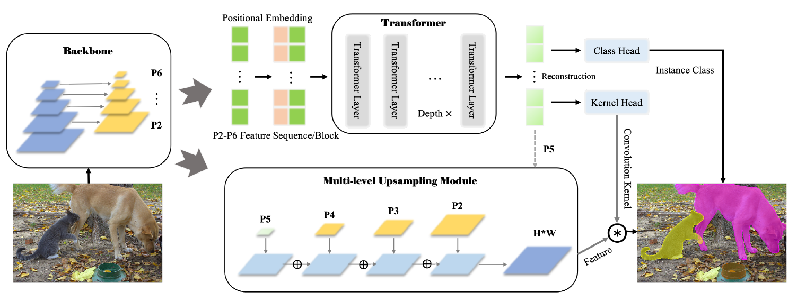

# SOTR: Segmenting Objects with Transformers

## Introduction

We present a novel, flexible, and effective transformer-based model for high-quality instance segmentation. The performance of SOTR achieves 40.2% of AP with the ResNet-101-FPN backbone on the MS COCO benchmark. Also, SOTR demonstrates significantly better performance on medium 59.0% and large objects 73.0%.

## Acknowledgement
Thanks [Detectron2](https://github.com/facebookresearch/detectron2) contribution to the community!
The work is supported by National Key R&D Program of China (2020YFD0900204) and Key-Area Research and Development Program of Guangdong  Province China (2020B0202010009).